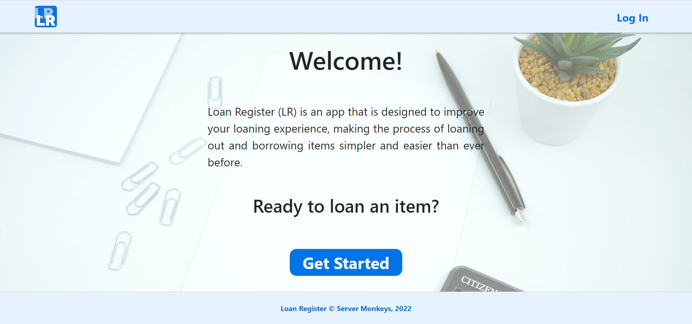

# Loan-Register-Frontend




This is the forked the repository for **Frontend development**. <br/>
The project is under subject COMP30022 in semester 2 2022.

Deployed app: https://loan-register.herokuapp.com/

Source code: [Server Monkeys Fontend](https://github.com/IT-Project-Server-Monkeys/Loan-Register-Frontend) 

Source organisation: [Server Monkeys](https://github.com/orgs/IT-Project-Server-Monkeys/repositories)

Confluence page: [Server Monkeys Confluence](https://servermonkeys.atlassian.net/wiki/spaces/IP/pages)

### Run the code locally
```
npm install
```
```
npm start
```

### Project Contributors
* Bruce Zhu
* Huy Luu
* Jocelyn Ch'ng
* Phoebe Bear
* Vivien Guo
